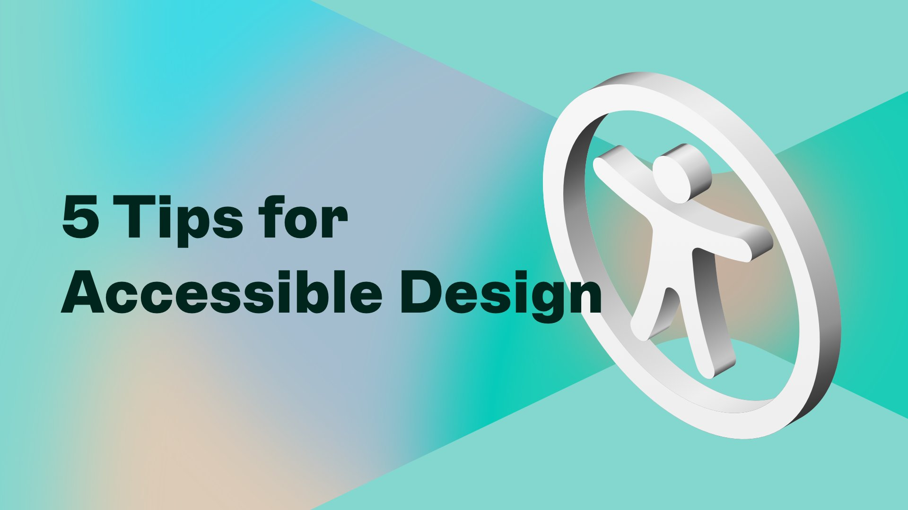
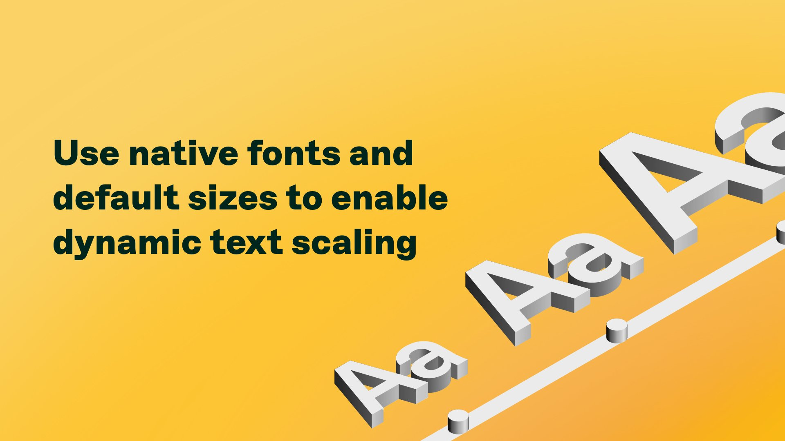
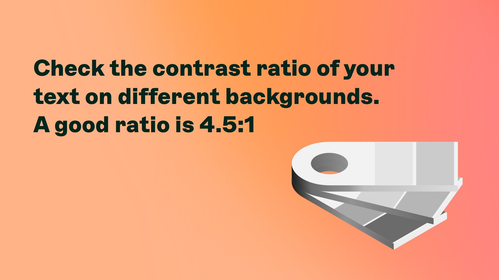
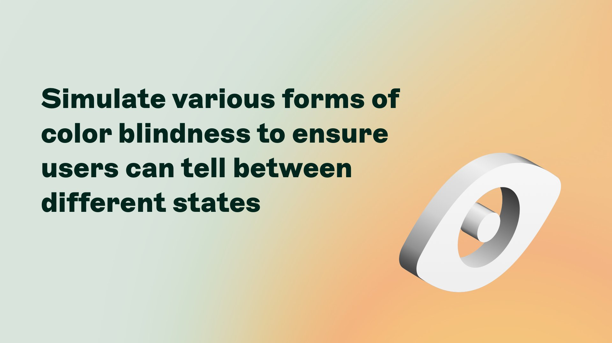
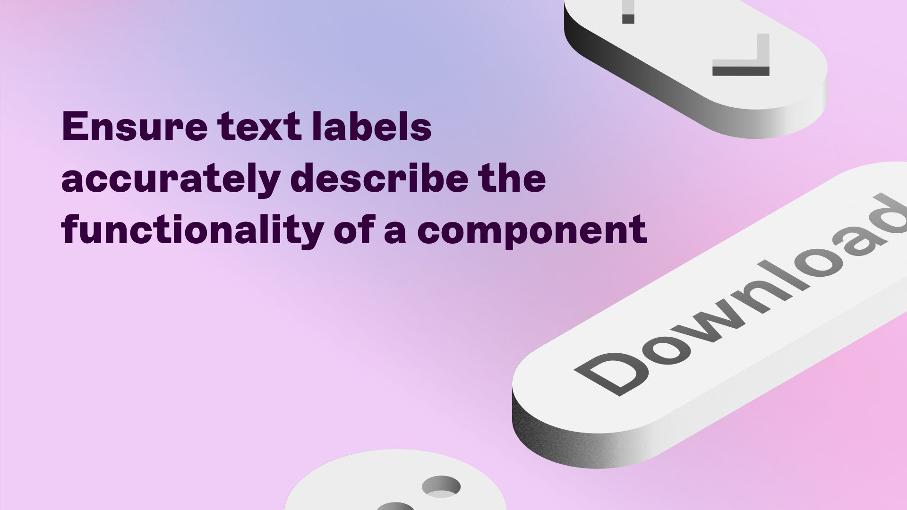
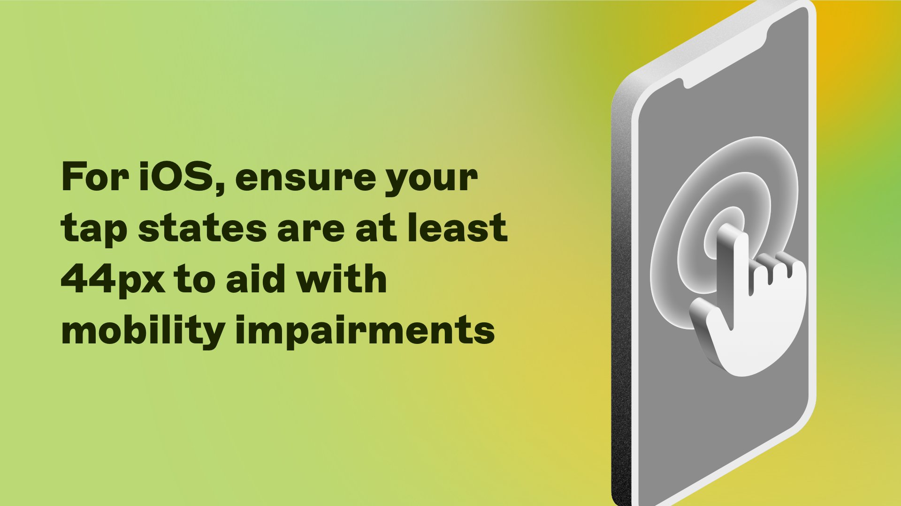

# 💎 Some design tips from the Sketch

<figure><figcaption></figcaption></figure>

## :abc:Text sizing

For text issues, you can use native fonts and default text sizes to enable dynamic text scaling when users enable accessibility in their system settings :capital\_abcd:

<figure><figcaption></figcaption></figure>

## :art:Color contrast ratio

Are your design and text easy to read? If not, test and play with your contrast on different backgrounds until you find the right ratio sung:dark\_sunglasses:

<figure><figcaption></figcaption></figure>

## :eye:Color blindness

Another way you can improve visual accessibility is through your designs’ color combinations. Consider testing various forms of color blindness :art:

<figure><figcaption></figcaption></figure>

## :label:Labels should describe the content

Make sure your labels are accurate and components are in the correct order for those who make use of VoiceOver to read out on-screen elements

<figure><figcaption></figcaption></figure>

## :mobile\_phone:Smaller screens = taking size and spacing into consideration :bulb:

Think about tap states and other ways your design can be improved for phones or tablets :mobile\_phone:

<figure><figcaption></figcaption></figure>


While the WCAG 2.1 recommends 44px, the [Lighthouse](https://web.dev/measure/) recommends **48x48px** touch size with at least 8px distance.

