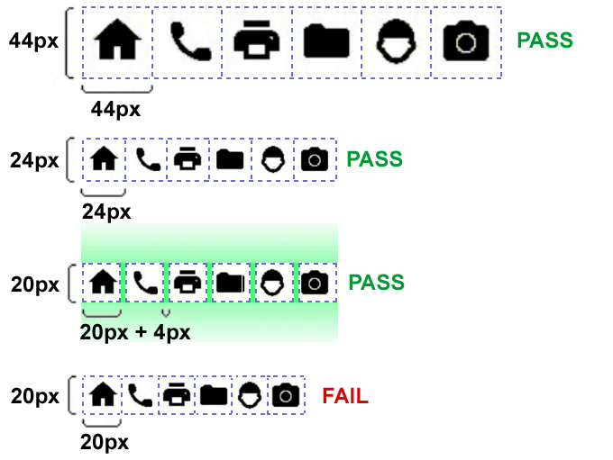

# ✍️ 2.5 Input Modalities

Make it easier for users to operate functionality through various inputs beyond the keyboard.


Added in WCAG 2.1.


## :blue\_book:Guides


Guideline 2.5 – Input Modalities


## Pointer Gestures (A)

Avoid using these modern touch-oriented gestures, like:

* multipoint gestures\
  like when the user needs two fingers to swipe a carousel or zoom in Map
* path-based gestures\
  like when the user needs to follow a given path with his cursor or finger.

All functionalities should be operated with a single pointing gesture and/or keyboard control too as a primary or alternative method.

## Pointer Cancellation (A)

The user could abort and/or undo any operations. There are many situations when the user can do something by mistake. We should provide opportunities to avoid or correct it.

Especially we should cautious with drag-and-drop features. These functions should be abortable without mistakes (like dropping elements into the wrong place).

## Label in Name (A)

All interactive elements (links, form input fields, buttons, etc) should have a label. The best if this could be a dedicated `<label>` element - if it's applicable.

The label value (text or alt text for images) must be presented visually. That's why we must avoid:

### Not override the default label with aria properties

Don't use `aria-label` or `aria-labelledby` properties to override the default label value: Instead of we overwriting the visible label with an extended one in an `aria-label` property, we can use the optional `title` property for this purpose. It will only extend the default label, not overwrite it.


```html
<p>Developed by <a href="https://brainsum.com" target="_blank" rel="author noopener" aria-label="Check out developers of diginomica.com.">BRAINSUM</a>.</p>
```



```html
<p>Developed by <a href="https://brainsum.com" target="_blank" rel="author noopener" title="Check out developers of diginomica.com.">BRAINSUM</a>.</p>
```


### Don't use empty interactive elements

We can't use empty interactive elements, ex.: an SVG icon only as the content of a `<button>` element: instead of overwriting the icon with `aria-label` property, we should provide a visually hidden element as a label text.


```html
<button class="js-search-trigger" aria-expanded="false" aria-controls="block-searchformblock" aria-label="Search toggler">
    <svg class="icon" role="img" width="16px" height="16px" viewBox="0 0 32 32" focusable="false">
        <title>Magnifier glass icon</title>
        <path d="M31.562 27.666l-6.231-6.231c-0.281-0.281-0.662-0.437-1.062-0.437h-1.019c1.725-2.206 2.75-4.981 2.75-7.999 0-7.181-5.818-12.999-12.999-12.999s-12.999 5.818-12.999 12.999c0 7.181 5.818 12.999 12.999 12.999 3.018 0 5.793-1.025 7.999-2.75v1.019c0 0.4 0.156 0.781 0.437 1.062l6.231 6.231c0.587 0.587 1.537 0.587 2.119 0l1.769-1.769c0.587-0.587 0.587-1.537 0.006-2.125zM13.002 20.998c-4.418 0-7.999-3.575-7.999-7.999 0-4.418 3.575-7.999 7.999-7.999 4.418 0 7.999 3.575 7.999 7.999 0 4.418-3.575 7.999-7.999 7.999z"></path>
    </svg>
</button>
```


<pre class="language-html" data-title="Working example #1" data-line-numbers data-full-width="true"><code class="lang-html">&#x3C;button class="js-search-trigger" aria-expanded="false" aria-controls="block-searchformblock">
    &#x3C;svg class="icon" role="img" width="16px" height="16px" viewBox="0 0 32 32" focusable="false">
        &#x3C;path d="M31.562 27.666l-6.231-6.231c-0.281-0.281-0.662-0.437-1.062-0.437h-1.019c1.725-2.206 2.75-4.981 2.75-7.999 0-7.181-5.818-12.999-12.999-12.999s-12.999 5.818-12.999 12.999c0 7.181 5.818 12.999 12.999 12.999 3.018 0 5.793-1.025 7.999-2.75v1.019c0 0.4 0.156 0.781 0.437 1.062l6.231 6.231c0.587 0.587 1.537 0.587 2.119 0l1.769-1.769c0.587-0.587 0.587-1.537 0.006-2.125zM13.002 20.998c-4.418 0-7.999-3.575-7.999-7.999 0-4.418 3.575-7.999 7.999-7.999 4.418 0 7.999 3.575 7.999 7.999 0 4.418-3.575 7.999-7.999 7.999z">&#x3C;/path>
    &#x3C;/svg>

<strong>    &#x3C;span class="visually-hidden">Search toggler&#x3C;/span>
</strong>&#x3C;/button>
</code></pre>


```html
<button class="js-search-trigger" aria-expanded="false" aria-controls="block-searchformblock" aria-labelledy="search-trigger__label">
    <svg class="icon" role="img" width="16px" height="16px" viewBox="0 0 32 32" focusable="false">
        <title id="search-trigger__label">Magnifier glass icon</title>
        <path d="M31.562 27.666l-6.231-6.231c-0.281-0.281-0.662-0.437-1.062-0.437h-1.019c1.725-2.206 2.75-4.981 2.75-7.999 0-7.181-5.818-12.999-12.999-12.999s-12.999 5.818-12.999 12.999c0 7.181 5.818 12.999 12.999 12.999 3.018 0 5.793-1.025 7.999-2.75v1.019c0 0.4 0.156 0.781 0.437 1.062l6.231 6.231c0.587 0.587 1.537 0.587 2.119 0l1.769-1.769c0.587-0.587 0.587-1.537 0.006-2.125zM13.002 20.998c-4.418 0-7.999-3.575-7.999-7.999 0-4.418 3.575-7.999 7.999-7.999 4.418 0 7.999 3.575 7.999 7.999 0 4.418-3.575 7.999-7.999 7.999z"></path>
    </svg>
</button>
```



**Hint:** For better accessibility for icon-only buttons we should provide describe text for user with lower cognitive. Ex.: tooltips with delay.

Live example: social icons or slider controls on [Diginomica.com](https://diginomica.com/).


## Target Size (AA-AAA)

All interactive elements must be at least:

* 24px x 24px in size for the mouse pointer (**level AA**),
* 44px x 44px in size for stylus/pen users and iOS touch devices (**level AAA**),
* 48px x 48px in size for Android touch devices (material design extra level),
* except:
  * if it's an inline link,
  * if it has an alternative (another element has the same link),
  * if the element size is provided by the browser.

The target size means:

* The interactive element's width and height are without margins.
* The interactive element's width and height plus margins.

<figure><figcaption><p>Target sizes according to W3C</p></figcaption></figure>


A good, nice and long article about the target size-related problems and solutions

